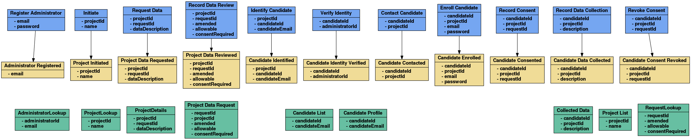

# les-viz: Event Markdown Vizualization (EMD -> GraphViz)

**Generates a [GraphViz](http://www.graphviz.org/) digraph for an event storming.**

[What is Event Markdown?](https://docs.letseventsource.org/faq/eventmarkdown/)

See also: https://webeventstorming.com

## Usage

```bash

$ les-viz --help
usage: les-viz [<flags>] [<file>]

Generates a http://www.graphviz.org/ digraph for an event storming.

Flags:
  --help     Show context-sensitive help (also try --help-long and --help-man).
  --version  Show application version.

Args:
  [<file>]  Event Markdown (.emd) file

```

## Generating a .png Image

Install GraphViz:

```bash

sudo apt-get install graphviz

```

Generate a visual representation of an event storming:

```bash

curl -L https://raw.githubusercontent.com/Adaptech/les/master/samples/consentaur/Eventstorming.emd > Eventstorming.emd \
&& les-viz Eventstorming.emd | dot -Tpng -o Eventstorming.png \
&& eog Eventstorming.png

```

