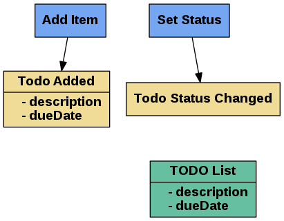
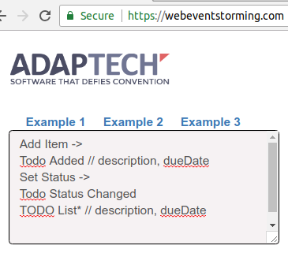
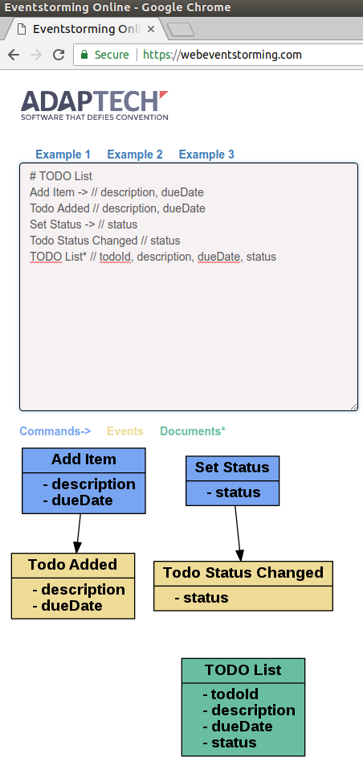
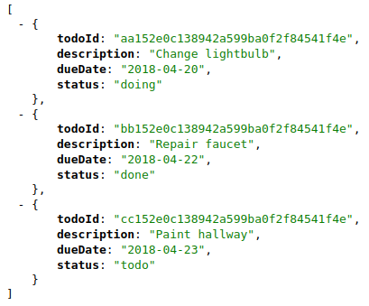
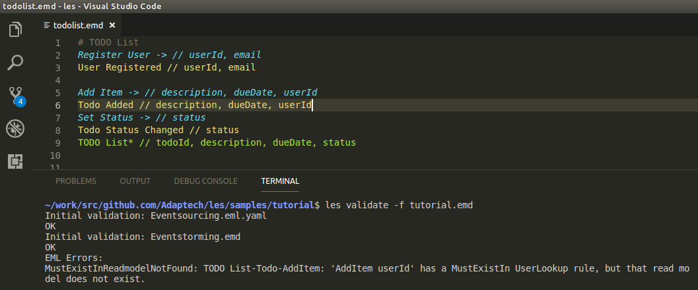
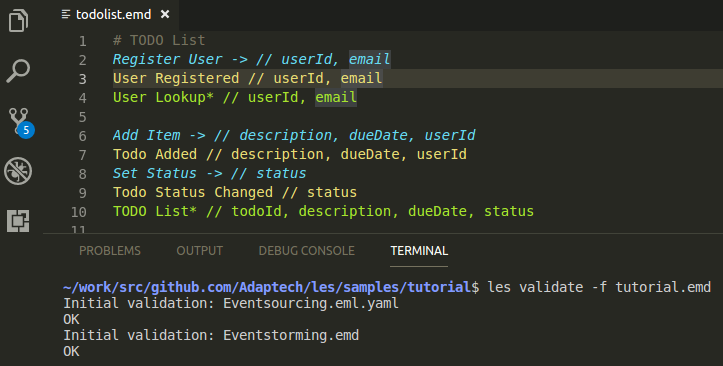

# Tutorial - Prototyping Event Sourced Microservices with LES


This tutorial shows how to use the ```les``` and ```les-node``` tools to build a NodeJS based event sourced microservice straight from an event storming. ```les``` and ```les-node``` are part of the LESTER stack ("Let's Event Source Together"). LESTER takes a specification for an event sourced system and produces deployment-ready commands, events, documentation and infrastructure. It is designed to make prototyping and starting implementation of an event based system simple and keep development efforts closely aligned with business objectives and requirements.

### 1. Do an Event Storming

**An event storming is a communications tool. It shows a path through a system, as events on a timeline. It's more useful, less time consuming, more fun and less tedious than use case analysis.**



**Event storming lessons we learned:** A nice diverse group of people consisting of leadership/management, developers & IT, UX & product folks, etc. works best. Avoid event storming remotely if at all possible. Nothing beats a wall with sticky notes with people in front of it talking to each other. It's human, it's storytelling, it's tactile. It's what you want. Trying to event storm with only technicians in the room misses the point - event storming is a tool to make sure everybody with a stake in the outcome shares an understanding of what the system does.

### 2. Turn it into Event Markdown

**Event Markdown (EMD) is a simple language used to capture the results of an event storming.**

```bash

Add Item -> 
Todo Added // description, dueDate
Set Status -> 
Todo Status Changed 
TODO List* // description, dueDate

```

Enter it at https://webeventstorming.com to see it as a graph:



* ```# This is a commment.```.

* This is a command: ```Command ->```. Commands can have parameters: ```Add Item -> // description, dueDate```

* And this is what events look like: ```Something Happened```. Or, with properties: ```Todo Added // description, dueDate```

* Finally, a document (also known as a read model): ```TODO List*``` or ```TODO List* // todoId, description, dueDate, status```

### 3. Turn it into "green" Event Markdown

**"Green" EMD is event markdown which follows some [simple conventions](https://github.com/Adaptech/letseventsource/blob/master/EMD-Cheatsheet-0.10.0-alpha.pdf) and has enough information to use it to generate an event sourced microservice API from it.**

To validate an EMD file for greenness, see ```les validate --help```.

Save this to a file called ```Eventstorming.emd```:

```bash

# TODO List
Add Item -> // description, dueDate
Todo Added // description, dueDate
Set Status -> // status
Todo Status Changed // status
TODO List* // todoId, description, dueDate, status

```



### 3. Convert Event Markdown (EMD) to Event Markup Language (EML)

```les convert```

Event Markup Language is a YAML schema for describing CQRS/ES based event sourced systems. EML makes the proposed design of the system accessible to tools like ```les validate``` which act as a kind of "architect in a box". It makes it possible to automatically validate whether implementing the design is likely to result in a good event sourced system:

* Will it have transactional integrity?
* Does it have all the necessary events and event properties to make it possible to determine the current state of aggregates/streams/state machines by re-playing them from the event store?
* Do the events have all the necessary information for building the read models?
* Have certain business rules been considered when modeling the domain? For example, is it possible to send an invoice after it's been deleted? (It probably shouldn't be.)

EML is implementation language agnostic. It doesn't matter what stack the CQRS/ES system will be written in. At the moment there is a builder for EML -> NodeJS (```les-node```). There's also EML -> Swagger spec to give developers a nice UI to play with the system's API. A EML -> Golang implementation is in early alpha.

__Modeling a CQRS/ES system from scratch guided by feedback from the ```les validate``` tool will be covered in a separate tutorial.__

### 4. Build and deploy the API

```bash

les-node -b Eventsourcing.eml.yaml
cd api && npm install && docker-compose up -d && docker-compose restart api

```

This implements the TODO list API in NodeJS, with in-memory read models and https://eventstore.org as event log. It is possible to configure the system to use Postgres, Cassandra or LevelDB for read model storage, but the generated ```docker-compose.yml``` contains a dev enviroment setup where everything is in memory and all events get re-played every time the API docker container is re-started. The source code can be found in ```./api```.

### 5. Try the API

Create a backlog of tasks:

```bash

curl -X POST "http://localhost:3001/api/v1/Todo/AddItem" -H "accept: */*" -H "Content-Type: application/json" -d "{\"description\":\"Change lightbulb\",\"dueDate\":\"2018-04-20\",\"todoId\":\"aa152e0c138942a599ba0f2f84541f4e\"}"
curl -X POST "http://localhost:3001/api/v1/Todo/AddItem" -H "accept: */*" -H "Content-Type: application/json" -d "{\"description\":\"Repair faucet\",\"dueDate\":\"2018-04-22\",\"todoId\":\"bb152e0c138942a599ba0f2f84541f4e\"}"
curl -X POST "http://localhost:3001/api/v1/Todo/AddItem" -H "accept: */*" -H "Content-Type: application/json" -d "{\"description\":\"Paint hallway\",\"dueDate\":\"2018-04-23\",\"todoId\":\"cc152e0c138942a599ba0f2f84541f4e\"}"

```

Look at the backlog:

```curl http://localhost:3001/api/v1/r/TODOList```

(... or go to the Swagger UI at http://localhost:3001/api-docs/#/Queries/get_r_TODOList.)

Pull some items from the backlog into TODO:

```bash

curl -X POST "http://localhost:3001/api/v1/Todo/SetStatus" -H "accept: */*" -H "Content-Type: application/json" -d "{\"status\":\"todo\",\"todoId\":\"aa152e0c138942a599ba0f2f84541f4e\"}"
curl -X POST "http://localhost:3001/api/v1/Todo/SetStatus" -H "accept: */*" -H "Content-Type: application/json" -d "{\"status\":\"todo\",\"todoId\":\"bb152e0c138942a599ba0f2f84541f4e\"}"
curl -X POST "http://localhost:3001/api/v1/Todo/SetStatus" -H "accept: */*" -H "Content-Type: application/json" -d "{\"status\":\"todo\",\"todoId\":\"cc152e0c138942a599ba0f2f84541f4e\"}"

```

Do start some work and complete some work:

```bash

curl -X POST "http://localhost:3001/api/v1/Todo/SetStatus" -H "accept: */*" -H "Content-Type: application/json" -d "{\"status\":\"doing\",\"todoId\":\"aa152e0c138942a599ba0f2f84541f4e\"}"
curl -X POST "http://localhost:3001/api/v1/Todo/SetStatus" -H "accept: */*" -H "Content-Type: application/json" -d "{\"status\":\"done\",\"todoId\":\"bb152e0c138942a599ba0f2f84541f4e\"}"

```

Here's the result:




Try adding and completing some more items at http://localhost:3001/api-docs.

To look some of the events which were stored to the event log and published when commands were POSTed, go to http://localhost:2113 (username 'admin', password 'changeit')


### 6. Iterate

#### Teardown

Delete the entire system with ...

```bash

cd api
docker-compose down

```

#### Retaining data from the previous iteration

To retain the event store data, delete just the API docker container but leave the eventstore running:

```bash

cd api
docker-compose stop api && docker-compose rm -f

```

#### Edit the EMD (or EML)

```les validate -f``` runs continuously, re-validating the EMD/EML each time ```Eventstorming.emd``` is saved:



This version makes sure that the "Add Item" userId parameter actually belongs to a registered user. But there is a validation error - for that to be possible, a read model must exist where users can be looked up by userId when somebody POSTs to ```/api/v1/Todo/AddItem```. Let's add one:

```bash

# TODO List
Register User -> // userId, email
User Registered // userId, email
User Lookup* // userId, email

Add Item -> // description, dueDate, userId
Todo Added // description, dueDate, userId
Set Status -> // status
Todo Status Changed // status
TODO List* // todoId, description, dueDate, status

```

Validation now passes:



#### Rebuild and deploy

```bash

les convert todolist.emd && \
les-node -b Eventsourcing.eml.yaml && \
cd api && \
npm install && \
docker-compose up -d && \
docker-compose restart api # The restart is a workaround for a race condition when starting containers. :-(

```

Try it:

```curl -X POST "http://localhost:3001/api/v1/Todo/AddItem" -H "accept: */*" -H "Content-Type: application/json" -d "{\"description\":\"Serpentlake\",\"dueDate\":\"Tuesday 3 May 2018\",\"todoId\":\"241dfb5c5e3243ea802e62a4ef000a5a\",\"userId\":\"48b0ef227d204fdc971def3deeb9ef4e\"}"```

... results in:

```{"message":[{"field":"userId","msg":"userId does not exist."}]}```

Therefore, register the user:

```curl -X POST "http://localhost:3001/api/v1/User/RegisterUser" -H "accept: */*" -H "Content-Type: application/json" -d "{\"email\":\"natalieharris066@test.com\",\"userId\":\"48b0ef227d204fdc971def3deeb9ef4e\"}"```

... and try adding a TODO item for that userId again:

```curl -X POST "http://localhost:3001/api/v1/Todo/AddItem" -H "accept: */*" -H "Content-Type: application/json" -d "{\"description\":\"Serpentlake\",\"dueDate\":\"Tuesday 3 May 2018\",\"todoId\":\"241dfb5c5e3243ea802e62a4ef000a5a\",\"userId\":\"48b0ef227d204fdc971def3deeb9ef4e\"}"```


The item can now be found in the TODO list read model:

```curl -X GET "http://localhost:3001/api/v1/r/TODOList" -H "accept: */*"```

returns ...

```json

[{"todoId":"241dfb5c5e3243ea802e62a4ef000a5a","description":"Serpentlake","dueDate":"Tuesday 3 May 2018","status":"","userId":"48b0ef227d204fdc971def3deeb9ef4e"}]

```

... because now a user with userId 48b0ef227d204fdc971def3deeb9ef4e exists:

```curl -X GET "http://localhost:3001/api/v1/r/UserLookup" -H "accept: */*"```:

```json

[{"userId":"48b0ef227d204fdc971def3deeb9ef4e","email":"natalieharris066@test.com"}]

```


